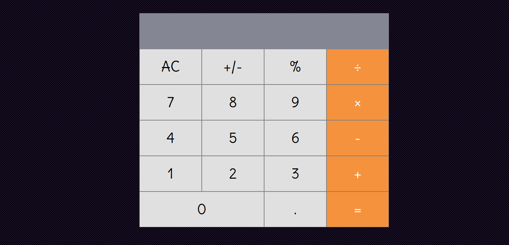

# React Calculator

> This is a simple calculator for Math-magicians Inc(a fictional company) using `create-react-app`.

## Built With

- JavaScript
- React

## Live Demo

[Live Demo Link](https://zen-kirch-2f8f0d.netlify.app/)

## Getting Started

To get a local copy up and running follow these simple example steps.

To get a local copy up and running follow these simple example steps.
- `git clone git@github.com:trekab/react-calculator.git`

Then you browse to the folder and exucute the following commands
- `cd react-calculator`
- run `npm install`
- run `npm run start` to have the app open up in your default browser.

## Authors

👤 **Treasure Kabareebe**

- Github: [@trekab](https://github.com/trekab)
- Twitter: [@TKabareebe](https://twitter.com/TKabareebe)
- Linkedin: [Treasure Kabareebe](https://www.linkedin.com/in/treasure-kabareebe/)

## 🤝 Contributing

Contributions, issues and feature requests are welcome!

Feel free to check the [issues page](issues/).

## Show your support

Give a ⭐️ if you like this project!

## Acknowledgments

- [Microverse](https://www.microverse.org/)

## 📝 License

This project is [MIT](lic.url) licensed.
